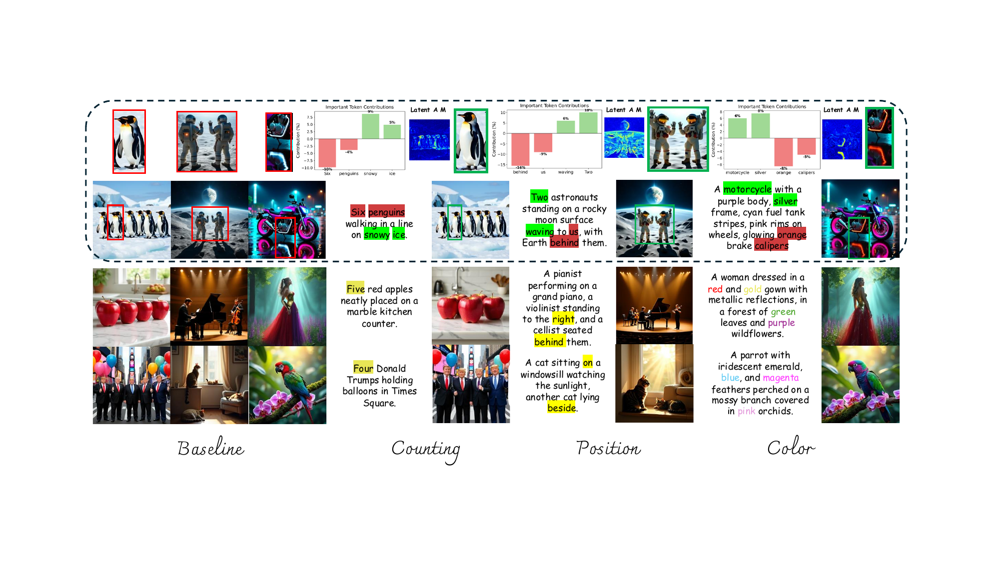

<h1 class="page-title">Self-Corrected Image Generation with Explainable Latent Rewards</h1>

<a href="#">Yinyi Luo</a>1,2, <a href="#">Hrishikesh Gokhale</a>1, <a href="#">Marios Savvides</a>1, <a href="https://jd92.wang/">Jindong Wang</a>3, <a href="https://shengfenghe.github.io/">Shengfeng He</a>2† 1Carnegie Mellon University, 2Singapore Management University, 3William & Mary

<h1>Abstract</h1>

Despite significant progress in text-to-image generation, aligning outputs with complex prompts remains challenging, particularly for fine-grained semantics and spatial relations. This difficulty stems from the feed-forward nature of generation, which requires anticipating alignment without fully understanding the output. In contrast, evaluating generated images is more tractable. Motivated by this asymmetry, we propose **xLARD**, a self-correcting framework that uses multimodal large language models to guide generation through E**x**plainable **LA**tent **R**ewar**D**s. xLARD introduces a lightweight corrector that refines latent representations based on structured feedback from model-generated references. A key component is a differentiable mapping from latent edits to interpretable reward signals, enabling continuous latent-level guidance from non-differentiable image-level evaluations. This mechanism allows the model to understand, assess, and correct itself during generation. Experiments across diverse generation and editing tasks show that xLARD improves semantic alignment and visual fidelity while maintaining generative priors, offering a data-efficient and generalizable solution to bridging the gap between comprehension and synthesis. 